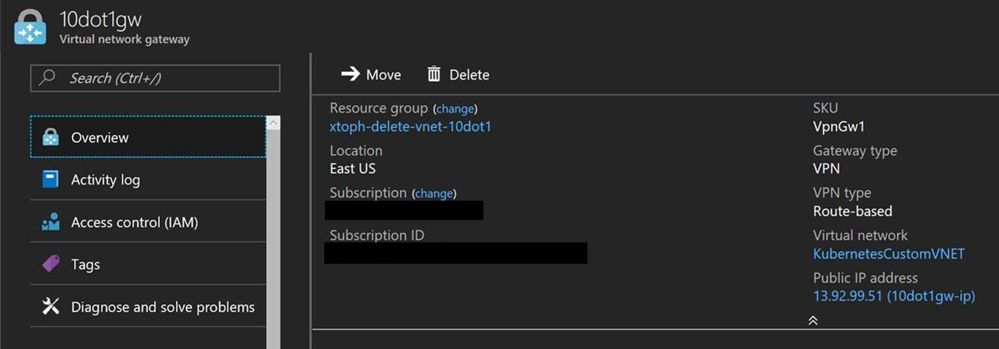
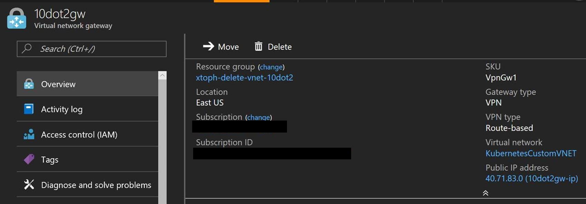
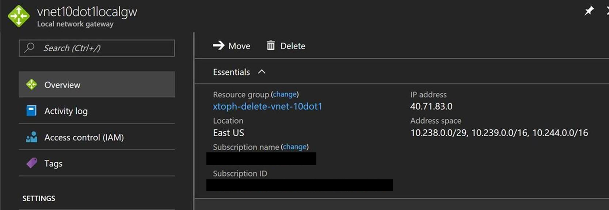
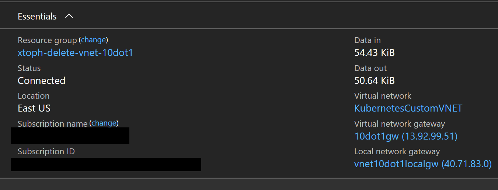
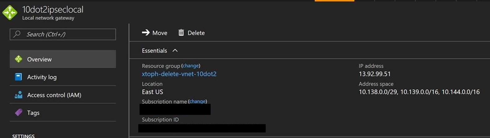
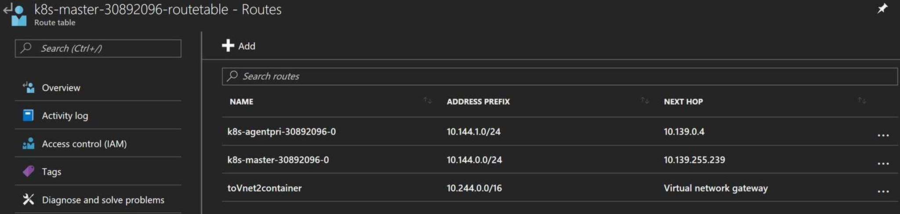
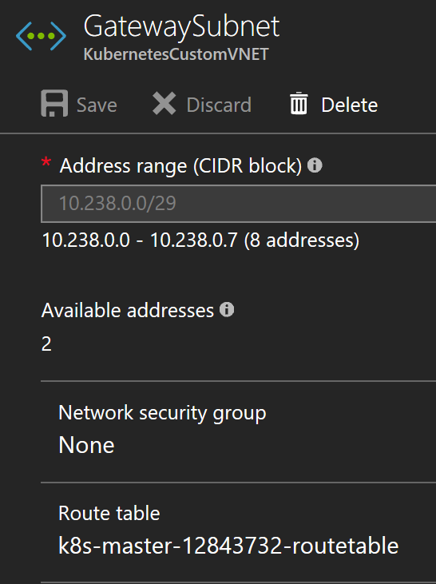

# Cross Vnet K8s clusters with ACS

Establishing a container network aware connection between 2 ACS k8s clusters. Standard Vnet-to-Vnet connections are not aware of the special reouting rules required to reach containers running in a k8s cluster. 

ACS configures the routing rules within the cluster's VNET. The VNet gateways to connect the two Vnets are not aware of these special routes.

The workaround is to configure the Connection between the Gateways as an IPSec Connection instead of a VNet-to-VNet connection, combined with routing rules on both sides to reach the containers in the other network. 

The IPSec connections connect to Local Network Gateways configured with the container IP address range.

Many thanks to [@pjperez](https://github.com/pjperez) for the pointers.   

```
Note: This is the documentation for clusters created with the CLI command `az acs create` or the Azure Portal.

For [acs-engine](http://github.com/azure/acs-engine) installs, simply [configure k8s for CNI](https://github.com/Azure/acs-engine/blob/master/docs/kubernetes/features.md) for container IPs to avoid the setup below.
```

## Automated Install
Scripts for automating setup coming soon

## Manual Install
We're connecting Vnet 1 with the address ranges 
- 10.139.0.0/16 for masters and agents
- 10.144.0.0/16 for containers 
- 10.138.0.0/29 for Virtual Networks 

to Vnet 2 with address ranges:
- 10.239.0.0/16 for masters and agents
- 10.244.0.0/16 for containers 
- 10.238.0.0/29 for Virtual Networks 

### Virtual Network Gateways
Vnet 1 has a Virtual Network Gateway VNet1Gw


Vnet 2 also has a Virtual Network Gateway VNet2Gw


### Local Network Gateways
The configuration for the Local Network Gateway LGw1 to connect the Virtual Network Gateway in VNet 1 to the Virtual Network Gateway in VNet 2 is configured with the Public IP Address for Vnet2Gw and the address ranges of VNet 2:



There is also a Local Network Gateway LGw2 to connect VNet 2 to VNet 1. This Local Gateway is configures with the Public IP address of VNet1Gw and the address ranges of VNet 1:


### VNet Gateway Connections
The connection for VNet1Gw to LGw1 connects VNet 1 to VNet 2. This has to be an IPSec connection.




The connection for VNet2Gw to LGw2 connects VNet 2 to VNet 1. This is also an IPSec Connection



### Routing Rules
VNet 1's configuration needs to be aware of the container network in VNet 2, which is not an Azure VNet subnet. Therefore the Route Table in VNet 1 needs a Route to direct IP traffic for the container network 10.244.0.0/16 to the Virtual Network Gateway

 

For the gateway in VNet 2, the GatewaySubnet needs to be aware of the routes to reach the containers in the route table. Therefore the GatewaySubnet needs to be associated with the Route Table.



## Verify Connection

- deploy an nginx container in the cluster in VNet 2, e.g. by running `kubectl run nginx --image=nginx`
- once the container is `Running`, get the container IP with `kubectl describe pod nginx | grep IP`
- test nginx with `curl <containerIP>`, where container IP is an address in the 10.244.0.0/16 range.
- `ssh` to the master in VNet 1
- verify that you're in VNet 1 by running `hostname -i`. You should see `10.139.255.239`
- verify you can access the container in the other VNet `curl <containerIP>`

